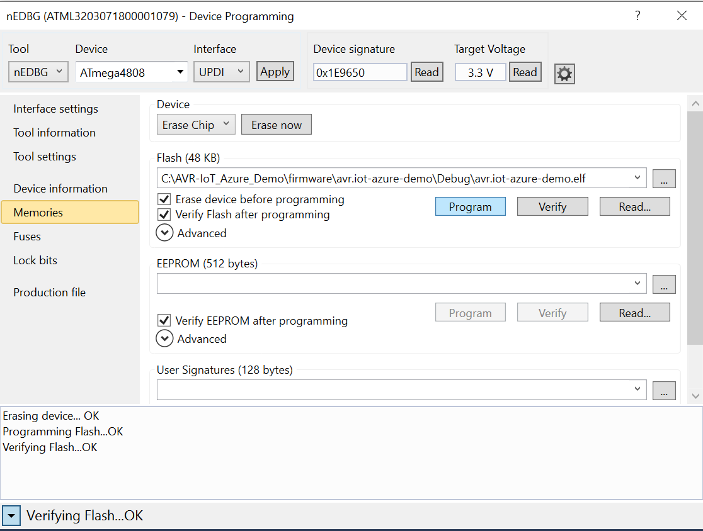

# Provisioning the Microchip AVR-IoT WA/WG Development Board for Azure IoT Services

## Introduction

 This document describes how to connect the AVR-IoT WA/WG Development Board (featuring an 8-bit ATmega4808 AVR MCU, ATECC608A secure element, and ATWINC1510 Wi-Fi module) to Azure IoT Hub. The AVR-IoT WA/WG Development Board will be provisioned for use with Azure IoT services using self-signed X.509 certificate-based authentication.

## Software Requirements

- [Latest Python Release](https://www.python.org/downloads/)

	NOTE: On the installation screen, check the box for "Add python.exe to PATH"

- [Python 3.5.4](https://www.python.org/downloads/release/python-354/)

	NOTE: On the installation screen, check the box for "Add python.exe to PATH"

- [Azure CLI](https://docs.microsoft.com/en-us/cli/azure/install-azure-cli?view=azure-cli-latest)

- [Microchip Studio IDE for AVR and SAM Devices](https://www.microchip.com/en-us/tools-resources/develop/microchip-studio)

- Microchip's [IoT Provisioning Tool](https://www.microchip.com/en-us/solutions/internet-of-things/iot-development-kits/iot-provisioning-tool)

## Hardware Requirements

- AVR-IoT ([WA](https://www.microchip.com/en-us/development-tool/EV15R70A) or [WG](https://www.microchip.com/en-us/development-tool/AC164160)) Development Board

## Instructions

1.	If you don't already have one, create a free [Azure account](https://azure.microsoft.com/en-us/free/?WT.mc_id=A261C142F).

2.	Sign into the [Azure Portal](https://portal.azure.com/).

3.	Follow the steps in the section [Create an IoT Hub](https://docs.microsoft.com/en-us/azure/iot-hub/quickstart-send-telemetry-node#create-an-iot-hub) to use the Azure CLI to create your own resource group and IoT Hub within the resource group.

4.	Clone this repository (or download ZIP file).

5.	Connect the AVR-IoT development board to the PC using a standard micro-USB cable. Upgrade the [ATWINC1510](https://www.microchip.com/en-us/product/ATWINC1510) module's internal firmware by opening a Command Prompt or PowerShell window and navigating to the location of the [IoT Provisioning Tool](https://www.microchip.com/en-us/solutions/internet-of-things/iot-development-kits/iot-provisioning-tool) which was previously downloaded (e.g. \iotprovision-bin-2.10.7.12.134\windows64). Execute the following command line:

    ```shell
	.\iotprovision-bin.exe -c azure
    ```

    NOTE: Ignore the error messages at the end regarding 'demo-azure'

6.	Launch the Microchip Studio IDE. A picture of the AVR-IoT development board should appear in its own dedicated window within the IDE.

	

7.	Program the *`avr.iot-azure-winc-provision.atsln`* project (located in the *“AVR-IoT_Azure_Demo\winc-provision”* directory) onto the AVR-IoT board.


	
	
	
	
	
	

8. Open a Command Prompt or PowerShell window (run as an Administrator).

9.	Navigate to the directory *“AVR-IoT_Azure_Demo\scripts”*.

10. Execute the following command lines:
    ```shell
	python --version
	py --version
	python -m pip install --upgrade pip
	pip install -r .\requirements.txt
	pip freeze
	pip --version
    ```
	

11. Execute the following Python script on the command line:
    ```shell
	.\create_and_verify_certs.ps1
    ```

	NOTE: Ignore the "Cannot rename" warning message. The unique name for the signer certificate can be any word you choose (no spaces)

12. Execute the following Python script on the command line:
    ```shell
	.\create_device_and_provision.ps1
    ```

	NOTES: When asked to enter the COM port of the device, use any terminal emulator program (e.g. TeraTerm) or Windows Device Manager to figure out the COM port which should be typed at the prompt.

	

13.	Copy (save) the device ID from the output of the PowerShell window.

	

14.	Using the Microchip Studio IDE, modify the credentials of the network, hub and device in the example demo project.
	1. Open the *`avr.iot-azure-demo.atsln`* project located in the *“AVR-IoT_Azure_Demo\firmware”* folder.
	2. Browse to the *“cloud”* sub-folder and open the `cloud.h` header file.
	3. Modify the network password and ssid for your wireless Access Point.
	4. Modify the `COMMON_NAME` with the device ID value from step 14.
	5. Go to the Azure portal and click on IoT Hub name. Copy the name from the Hostname tab.
	6. Modify the `HOST_ENDPOINT` definition with the value copied from the Hostname tab.

15. Program the `avr.iot-azure-demo.atsln` project onto the AVR-IoT board.

16. Go back into your Azure Portal account and launch a Cloud Shell prompt.

	

17. Execute the following command line on the Cloud Shell prompt
    ```shell
	az extension add --name azure-cli-iot-ext
    ```

18. Execute the following command line on the Cloud Shell prompt
	```shell
	az iot hub monitor-events --hub-name {MyIoTHubName} --device-id {MyDeviceID}
	```

	Note: replace *{MyIoTHubName}* and *{MyDeviceID}* with their actual names

19. For better visualization of data, open a Command Prompt or PowerShell window. Navigate to the *“AVR-IoT_Azure_Demo\scripts”* directory and execute the following command line:  
	```shell
	.\create_web_app.ps1
	```